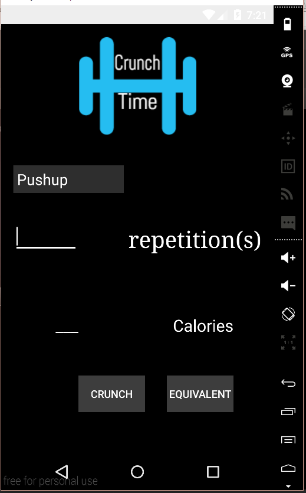
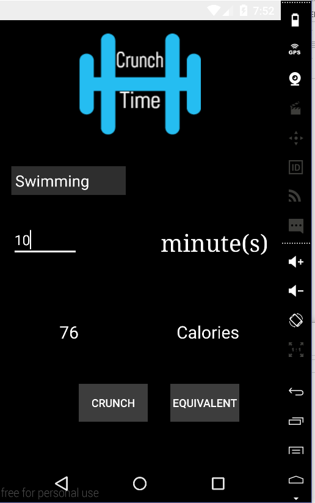

# PROG 01: Crunch Time

Briefly describe your app here.

## Authors

Yang Yu ([yangyu@berkeley.edu](mailto:your_email@berkeley.edu))

## Demo Video

See [Crunchtime] (https://link_to_your_video) in action!

## Screenshots

## Acknowledgments

* Flaticon for logo inspiration
* Eric Bo for critique

*Feel free to enhance your README. For Markdown syntax, see [the GitHub Guides](https://guides.github.com/features/mastering-markdown/). Remove this line in your submission.*
